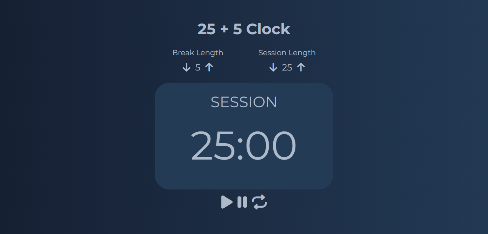

# 25 + 5 Clock

## SKILLS

- Functional Components
- useState
- useEffect
- useRef
- Responsive
- setTimeout
- Audio
- HTML
- Sass
- CSS
- Javascript
- React
- Vite
- Standard (ESLINT)

---
## LINKS

- Live Site URL: https://andr3sc0des.github.io/clock-timer

---